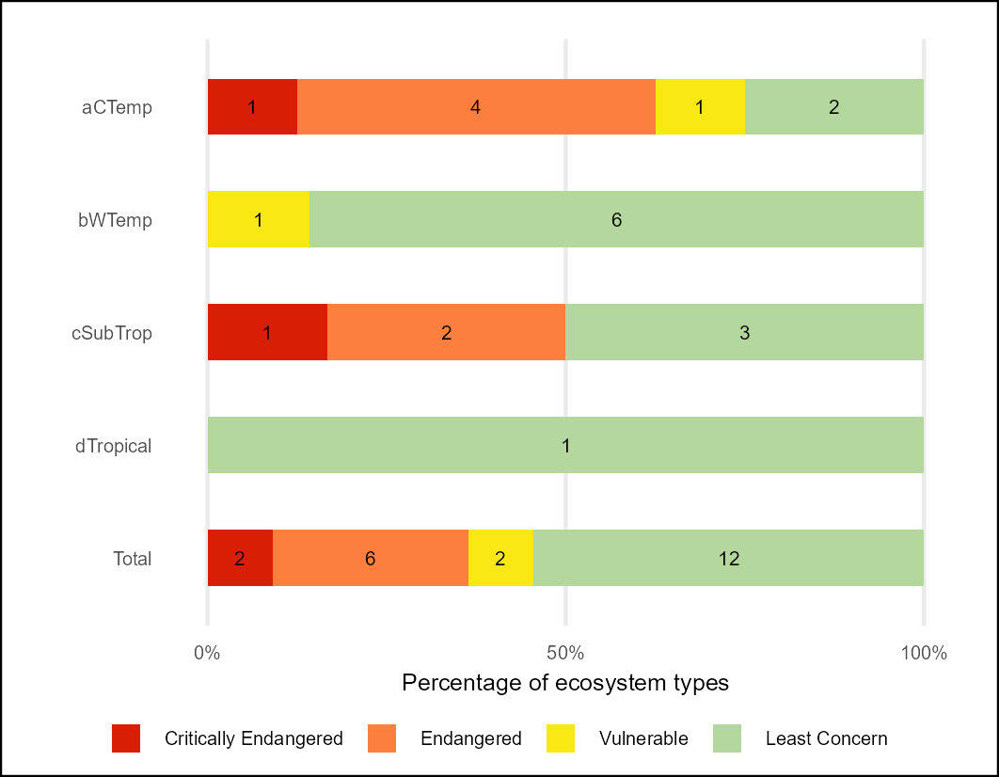
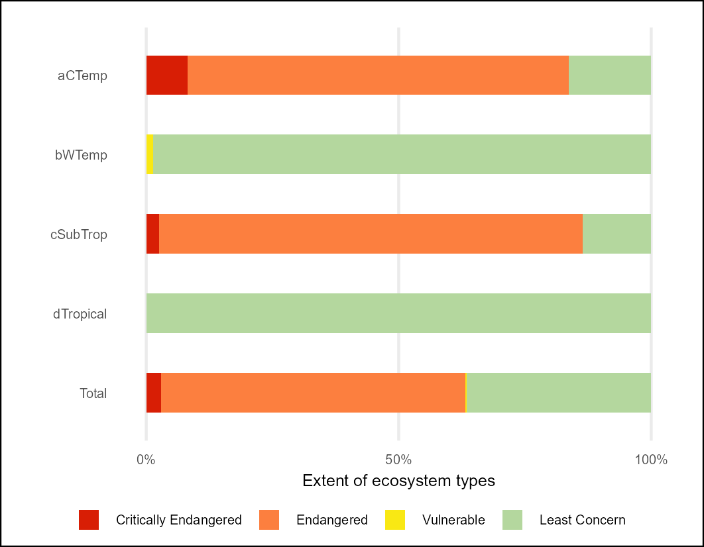
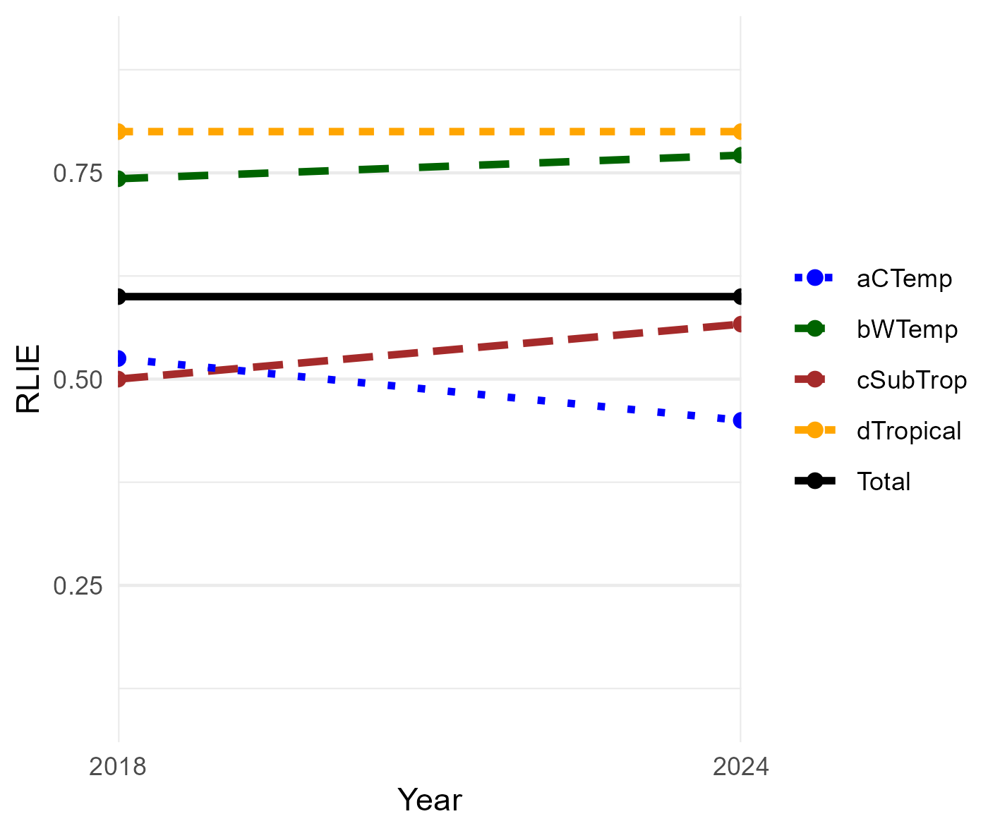

## **Workflows for undertaking the Estuarine Red List of Ecosystems (RLE) assessment**

### **National Biodiversity Assessment - South Africa**

*Council for Scientific and Industrial Research (CSIR) and the South African National Biodiversity Institute (SANBI)*

July 2025

#### **Summary**

This repository contains a workflow that results in the NBA 2025 Red List of Ecosystems indicator for Estuarine Ecosystems of South Africa. The Red List of Ecosystems (also known as Ecosystem Threat Status in South Africa) assesses the risk of collapse of each ecosystem type based on a range of criteria on extent, condition and pressures faced by each ecosystem type.

The Quarto document [RLE_estuaries.qmd](RLE_estuaries.qmd) describes the import of the South African estuary spatial data, Estuarine Health assessment tables (van Niekerk pers com) and national land cover change data for 1990, 2014, 2018 and 2022 (prepared by SANBI based on DFFE NLC data). The data were analysed using the terra and sf packages in R and summarised using the tidyverse. The 290 individual estuaries described for South Africa are assigned to 22 distinct ecosystem types (based on a range of physical and biological characteristics, and grouped in to four biogeographical zones (Cool Temperate, Warm Temperate, Sub Tropical and Tropical) ([van Niekerk et al. 2020](https://doi.org/10.2989/16085914.2019.1685934)).

Estuarine Condition (Health) scores (0-100) are assigned to Present Ecological State "PES" categories (A-F) and NBA Modification categories (Natural - Severely modified) according to the table below.

| Condition score (0-100) | "PES" category | Modification category        |
|-------------------------|----------------|------------------------------|
| \>= 90                  | A              | Natural                      |
| \>=75 & \< 90           | B              | Near Natural                 |
| \>= 60 & \< 75          | C              | Moderately Modified          |
| \>=40 & \< 60           | D              | Heavily Modified             |
| \< 40                   | E/F            | Severely/Critically Modified |

: The IUCN RLE (v2) framework was applied and following criterion were assessed:

-   Criterion A2b (current rate of decline in ecosystem extent); based on land cover change rates between 1990 and 2022 - projected forward to 2040.

-   Criterion A3 (historical reduction in ecosystem extent), based on land cover 2022

-   Criterion B1aii was applied using EOO calculations with ongoing decline defined as a decline in the extent of good/moderate condition estuarine extent (PES Classes A, B, C) from the previous PES assessment period.

-   Criterion B3.........to be completed

-   Criterion D3 was applied to the Estuarine Ecological State Class (PES) data such that severity of biotic disruption of \>= 90% was assumed for PES classes E-F; Severity \>=70% was assigned to PES classes D-F; Severity \>=50% was assigned to PES classes C-F. Each of the 22 estuary ecosystem types were assigned to one of the four risk categories: Critically Endangered, Endangered, Vulnerable and Least Concern. The highest risk category for these two criteria is selected as the threat / risk status for each river type.

#### **Results:**

Overall per-ecosystem type RLE results [rle_est_metrics_per_type.csv](outputs/rle_est_metrics_per_type.csv)

Summary table - count of estuarine ecosystem types per biogeographic zone per RLE category [rle24_est_sum_count.csv](outputs/rle24_est_sum_count.csv)

Summary table - extent of estuarine ecosystem per biogeographic zone per RLE category [rle24_est_sum_ext.csv](outputs/rle24_est_sum_ext.csv)

| RLE - count of types per category | RLE - extent of types per category |
|------------------------------------|------------------------------------|
|  |  |

**RLE Index**

Reflecting changes in ecosystem RLE between 2018 and 2024

**Combined RLE and EPL results**

The Quarto document [RLE_EPL_results.qmd](RLE_EPL_results.qmd) describes the combination of the RLE and EPL results and the production of a spatial version of the results attached to a estuarine functional zone map extracted from the South African IEM5_12_07012025 (curated by SANBI).

**Highly threatened and under-protected ecosystems**

30% of estuary types (7/22) are highly threatened (EN/CR) and under protected (NP/ PP), 5 of these occur in the Cool Temperate biogeographical region
