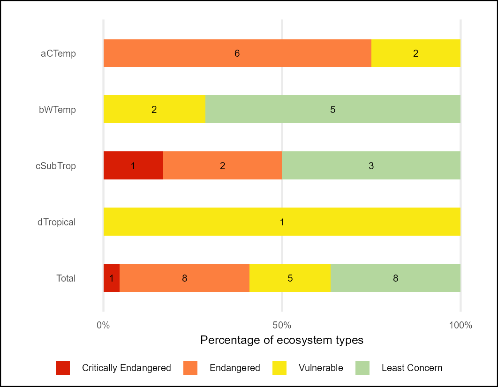
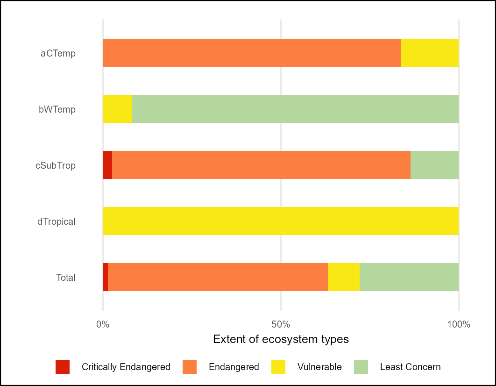

## **Workflows for undertaking the Estuarine Red List of Ecosystems (RLE) assessment**

### **National Biodiversity Assessment - South Africa**

*Council for Scientific and Industrial Research (CSIR) and the South African National Biodiversity Institute (SANBI)*

July 2025

#### **Summary**

This repository contains a workflow that results in the NBA 2025 Red List of Ecosystems indicator for Estuarine Ecosystems of South Africa.

The Quarto document [RLE_estuaries.qmd](RLE_estuaries.qmd) describes the import of the South African estuary spatial data and Estuarine Health assessment tables (van Niekerk et al., 20240. The data were analysed using the sf package in R and summarised using the tidyverse.

Estuarine Health Scores are assigned to PES categories A-F and Condition Classes (Natural - Severely modified) according to the table below.

| Estuarine Health SCORE | Ecological State CLASS | Condition CATEGORY           |
|------------------------|-------------------|------------------------------|
| \>= 90                 | A                      | Natural                      |
| \>=75 & \< 90          | B                      | Near Natural                 |
| \>= 60 & \< 75         | C                      | Moderately Modified          |
| \>=40 & \< 60          | D                      | Heavily Modified             |
| \< 40                  | E/F                    | Severely/Critically Modified |

: The Red List of Ecosystems (also known as Ecosystem Threat Status in South Africa) assesses the risk of collapse of each ecosystem type based on a range of criteria on extent, condition and pressures faced by each ecosystem type.

The IUCN RLE (v2) approach was followed and Criterion D3 was applied to the Estuarine Ecological State Class (PES) data such that Severity of biotic disruption of \>= 90% was assumed for PES classes E-F; Severity \>=70% was assigned to PES classes D-F; Severity \>=50% was assigned to PES classes C-F. Criterion B1aii was applied using EOO calculations with ongoing decline defined as a decline in the extent of good/moderate condition estuarine extent (PES Classes A, B, C) from the previous PES assessment period. Each of the 22 estuary ecosystem types were assigned to one of the four risk categories: Critically Endangered, Endangered, Vulnerable and Least Concern. The highest risk category for these two criteria is selected as the threat / risk status for each river type.

#### **Results:**

Overall per-ecosystem type RLE results [rle_est_metrics_per_type.csv](outputs/rle_est_metrics_per_type.csv)

Summary table - count of estuarine ecosystem types per biogeographic zone per RLE category [rle24_est_sum_count.csv](outputs/rle24_est_sum_count.csv)

Summary table - extent of estuarine ecosystem per biogeographic zone per RLE category [rle24_est_sum_ext.csv](outputs/rle24_est_sum_ext.csv)

| RLE - count of types per category | RLE - extent of types per category |
|----|----|
|  |  |

: RLE for Estuaries 2025
